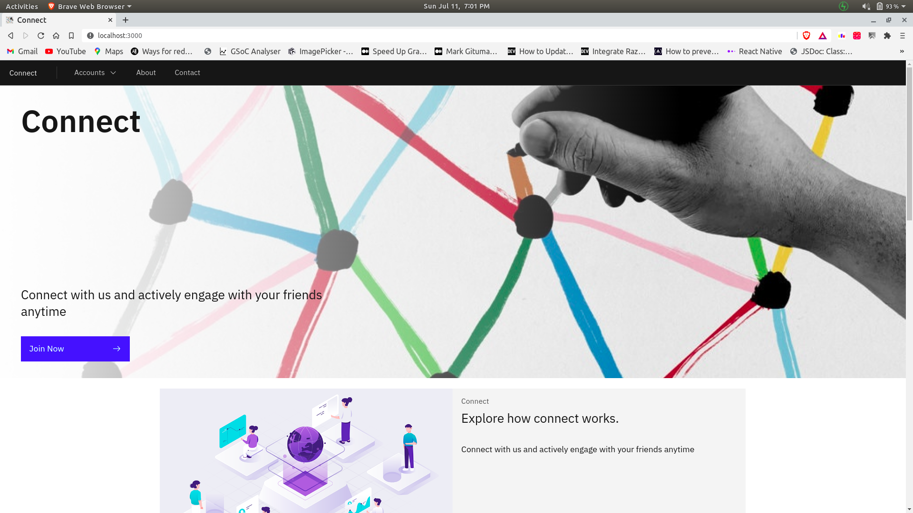
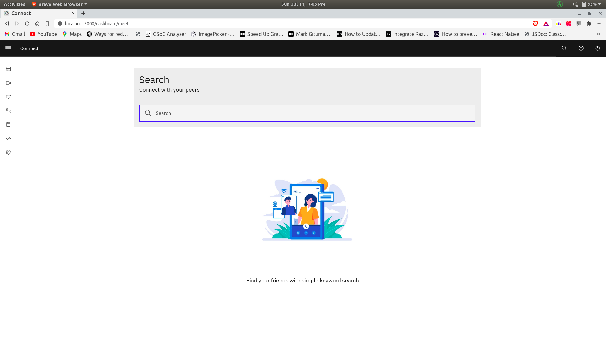
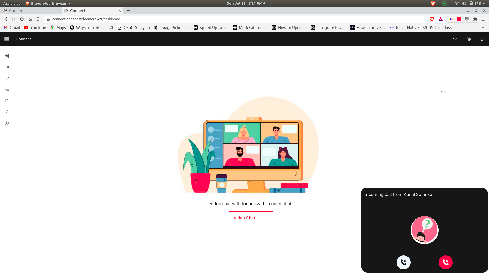
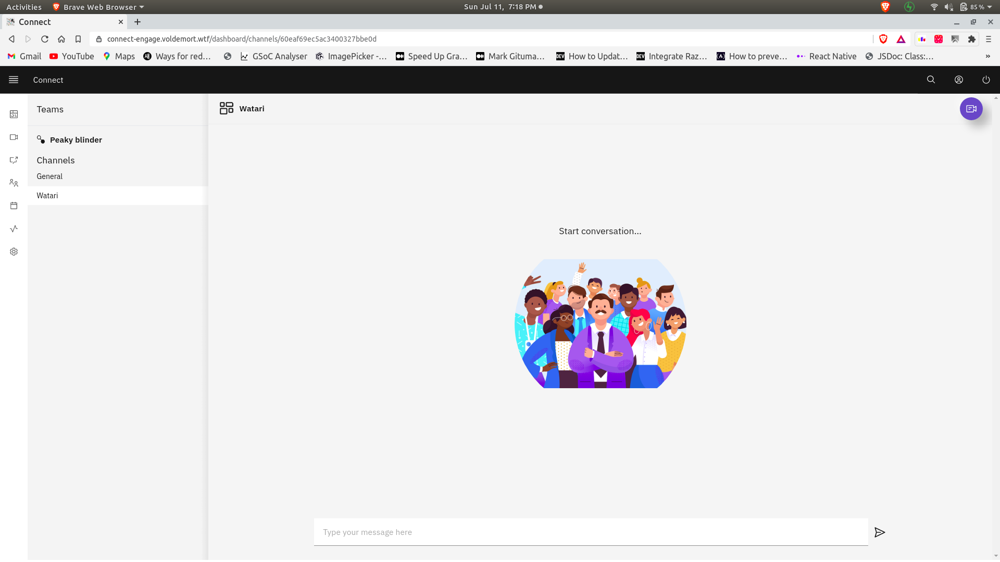
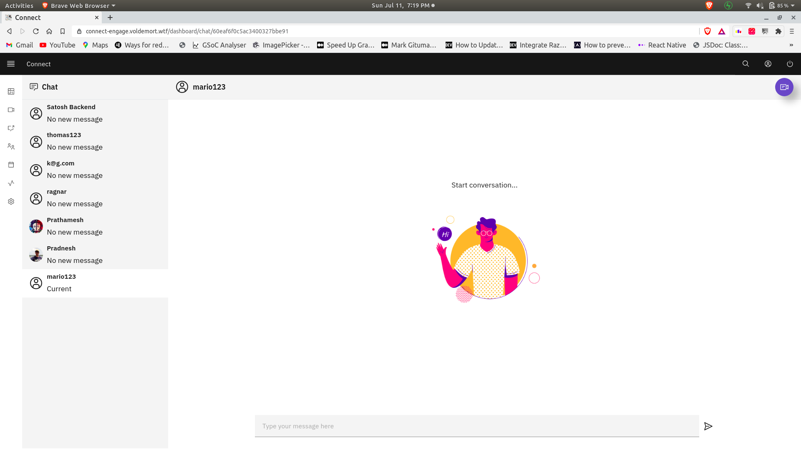
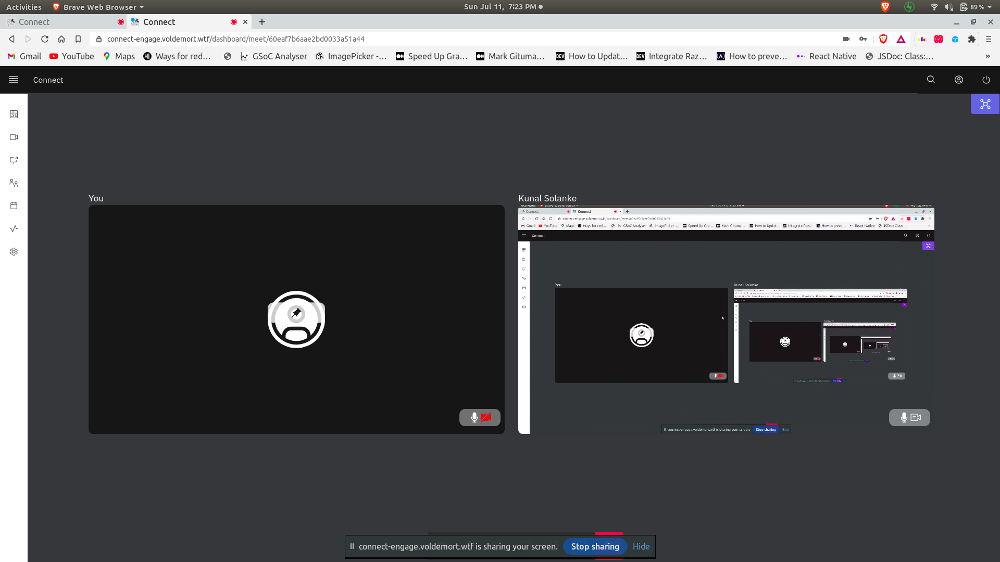

# Connect

Connect: Helps youActivey enagage and collaborate with your peers.
**[Join now](https://connect-engage.voldemort.wtf)**

<br/>


# Stack

- react
- simple peer
- docker
- express js
- admin bro
- socket io
- carbon design lib and desgin aspects

# Docs

Lets talk a little about docs.
I have used js docs for both client and server so here are github pages of both

1. [Frontend](https://kunalsolanke.github.io/EngageReactDocs/)
2. [Backend](https://kunalsolanke.github.io/EngageNodeDocs/)

if you are a reader docs inside the code are self sufficient

1. [Frontend](./client)
2. [Backend](./server)

More info can be found inside the readmes of both folders

# Features

Let's start with listing and somewhat knowing what they are:

## Authentication

    - Google
    - Github

    Involves complete jwt authetication flow,including
    social auth with passport js and jwt

> :Warning: If you are using some add blockers or browsers like brave which by default block
> third party cookies,please allow them first,even Ms teams web won't work without that.

## Call User

I wanted to keep the user flow as close to MS teams as possible,so here's first of it.You can search a person and call him and person at other end will receive a call.

## 1-1 Chat

Users can choose to chat with anyone just by searching them and adding them to the contacts so that they can chat with them through chatpage later

```
Imeplentation details:
Messages are persisted with chatId and message object inside
mongo database with the help of socket events
```

## Teams

1-1 chat was looking simple so just took the conecpt and scaled it ms teams group concept.Users can create a team,join a team,create a channel.And start group meeting on the channels.
Note : I like to think it as primitive version of mS Team's
group feature,so I doesn't link group permission and rest yet.

## Activites

Users can see their feed or activity logs through either calendar or simple list view if they prefer so.
Event that will be listed are as follows:

```
   Signup
   create team
   create channel
   call user
   reject call
   aborrt call
   start meet
   join meet
   leave meet
```

## Profile crud

Users can update their profile data through settings page,this plays supporting role in video meetings where profile info of users is shown

## Video chat

Well finally towards the main attraction ,video chat invovles some intresting moving components.Wanted to focus on video experience more in this part so ui components are mentioned as well.

### Pin user

A user can be pinned inside the meet,and all the rest users will be pushed to top bar which can be minmized.
Peers in the top bar can be added back to main area.

### 1-n video chat

Mutiple people can the meet and ui for multiple people is joining as follows,all the rest users get notified that new user has joined and if the deck is at its limit
(2) new user is pushed to top bar.

### Chat inside meet

This chat is persited inside db,and if meet started from the 1-1 call or teams chat,same chat will be used inside the meet.
If you invite muliple users in 1-1 call the current chat will be labelled as group chat and all meeting particoipants will be added
in that.
If meeting was started inside a team channel,invitees will be added to the team to which that channel belongs.

### Screen share

Users can start their screen share with button below,this will replace the videoTrack of all the rest peers inside the meet.
On stopping screen share camera video will be replaced back.

## Stop and start audio

When some stops or starts his audio or video such changes are reflected on the screens of rest of the other peers;
if video is off/not active : user's profile is shown
if audio is off/not active : mute symbol is shown

# Folder structure

- Client : React
- server : express
- coturn : turn docker files
- images : snapshots

more inside the respectivefolder

# User flow and plans

I used whimiscal to lay the basic user flow in the beginning and then used trello to follow through plan
and list all important things

1. [Trello](https://trello.com/b/atuNjaPP/engage)
2. [UserFlow](https://whimsical.com/connect-engage-CGWvuzuggiU1sKJBbg8psn)

## Here are some snaps

Here we have a quick glimse at all the ui aspects of Connect

## Main Nav


Call user


Chat 


MeetPage


You can take quick look at gallery [here](Gallery.md)
