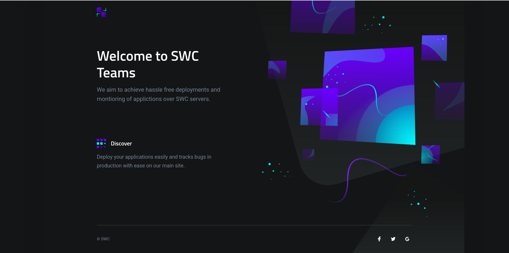

# Nodejs boilerplate

     This is just another nodejs boilerplate with docker and eslint configuration to make dev easier .



## Skeleton

Here is the basic suggested skeleton for your app repo that each of the starter templates conforms to:

```bash
├── public(html file)
├── src
    ├──components(add your components here)
│   ├── layouts(add yours layout here)
│   └── pages(add yours pages here)
    └── routes(add all yours routes here)
├── README.md
├── Dockerfile
├── docker_compose.yaml
├── package.json
├── yarn.lock(if using yarn)
└── .gitignore
```

> If you are using multer to save files on disc,configure it to save files inside pulblic>upload folder

## Dev Setup

> NOTE : Dockerfiles for react are mostly build in regards of production builds, in dev you don't need to use docker if you want coz react itlsef uses a lot of compoute resourdces

The docker files and environment variables are configured to be spin up mongo db inside one docker container and your applications inside another container.If you want to learn docker here is full [tutorial]()

> NOTE : Please do not remove the environment the variables already present inside the env file

```bash
  #To start the containers
  docker-compose up
  #Stop containers in diff terminal than docker
  docker-compose --volumes down
  #build docker images
  docker-compose up --build #if there are changes in installed deps
  #faster builds
  COMPOSE_DOCKER_CLI_BUILD=1 DOCKER_BUILDKIT=1 docker-compose build
  #windows
  set "COMPOSE_DOCKER_CLI_BUILD=1" & set "DOCKER_BUILDKIT=1" & docker-compose build
  # or to make this permanent add following to docker daemon /etc/docker/daemon.json
  { "features": { "buildkit": true } }
```

**Withour docker**

```bash
yarn add/npm install
yarn start #start the server
#remove landing page designs if you want
```

**Helpers:**

1. Remove dangling images: `docker rmi $(docker images -f dangling=true -q ) -f`
2. Remove all volumes: `docker volume rm $(docker volume ls -q)`

## Editor Setup

If you're using Visual Studio Code, you can install the ESLint extension, which
will automatically highlight warnings and errors using this boilerplate.

1. Press **Ctrl + Shift + X** or click the **Extensions** button
2. Search for **ESLint** and **Prettier(to format your code)**
3. Click the **Install** button next to the **ESLint** search result

With this extension, you can also choose to automatically fix/format your code
when you save. Add the following to your Visual Studio Code settings.

```
"eslint.autoFixOnSave": true
"editor.formatOnSave": true,
```

This setting only takes effect if `files.autoSave` is set to `off`,
`onFocusChange`, or `onWindowChange`.

# Getting Started with Create React App

This project was bootstrapped with [Create React App](https://github.com/facebook/create-react-app).

## Available Scripts

In the project directory, you can run:

### `yarn start`

Runs the app in the development mode.\
Open [http://localhost:3000](http://localhost:3000) to view it in the browser.

The page will reload if you make edits.\
You will also see any lint errors in the console.

### `yarn test`

Launches the test runner in the interactive watch mode.\
See the section about [running tests](https://facebook.github.io/create-react-app/docs/running-tests) for more information.

### `yarn build`

Builds the app for production to the `build` folder.\
It correctly bundles React in production mode and optimizes the build for the best performance.

The build is minified and the filenames include the hashes.\
Your app is ready to be deployed!

See the section about [deployment](https://facebook.github.io/create-react-app/docs/deployment) for more information.

### `yarn eject`

**Note: this is a one-way operation. Once you `eject`, you can’t go back!**

If you aren’t satisfied with the build tool and configuration choices, you can `eject` at any time. This command will remove the single build dependency from your project.

Instead, it will copy all the configuration files and the transitive dependencies (webpack, Babel, ESLint, etc) right into your project so you have full control over them. All of the commands except `eject` will still work, but they will point to the copied scripts so you can tweak them. At this point you’re on your own.

You don’t have to ever use `eject`. The curated feature set is suitable for small and middle deployments, and you shouldn’t feel obligated to use this feature. However we understand that this tool wouldn’t be useful if you couldn’t customize it when you are ready for it.

## Learn More

You can learn more in the [Create React App documentation](https://facebook.github.io/create-react-app/docs/getting-started).

To learn React, check out the [React documentation](https://reactjs.org/).

### Code Splitting

This section has moved here: [https://facebook.github.io/create-react-app/docs/code-splitting](https://facebook.github.io/create-react-app/docs/code-splitting)

### Analyzing the Bundle Size

This section has moved here: [https://facebook.github.io/create-react-app/docs/analyzing-the-bundle-size](https://facebook.github.io/create-react-app/docs/analyzing-the-bundle-size)

### Making a Progressive Web App

This section has moved here: [https://facebook.github.io/create-react-app/docs/making-a-progressive-web-app](https://facebook.github.io/create-react-app/docs/making-a-progressive-web-app)

### Advanced Configuration

This section has moved here: [https://facebook.github.io/create-react-app/docs/advanced-configuration](https://facebook.github.io/create-react-app/docs/advanced-configuration)

### Deployment

This section has moved here: [https://facebook.github.io/create-react-app/docs/deployment](https://facebook.github.io/create-react-app/docs/deployment)

### `yarn build` fails to minify

This section has moved here: [https://facebook.github.io/create-react-app/docs/troubleshooting#npm-run-build-fails-to-minify](https://facebook.github.io/create-react-app/docs/troubleshooting#npm-run-build-fails-to-minify)
