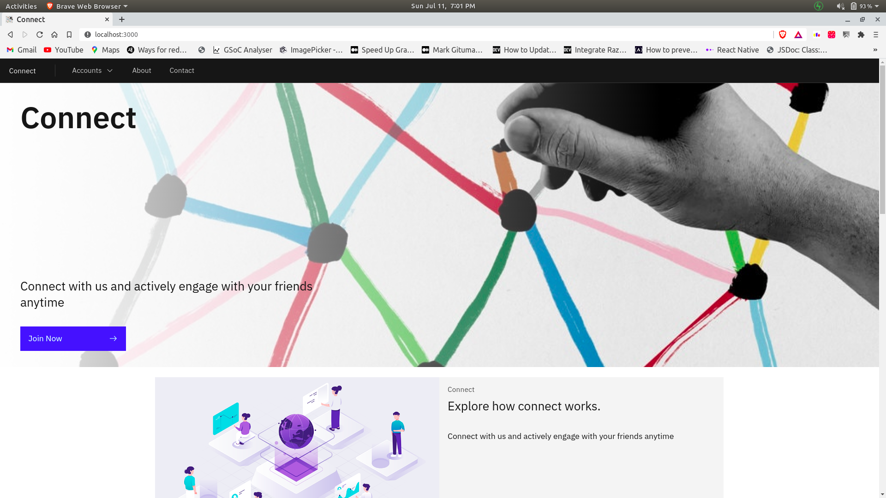

# Connect React

This is frontend folder.



## Skeleton

Here is the basic suggested skeleton

```bash
├── public(html file)
├── src
    ├──components(add your components here)
│   ├── layouts(add yours layout here)
│   └── pages(add yours pages here)
    └── routes(add all yours routes here)
├── README.md
├── Dockerfile
├── docker_compose.yaml
├── package.json
├── yarn.lock(if using yarn)
└── .gitignore
```

## Dev Setup

**Withour docker**

```bash
yarn add/npm install
yarn start #start the server
#remove landing page designs if you want
```

**Helpers:**

1. Remove dangling images: `docker rmi $(docker images -f dangling=true -q ) -f`
2. Remove all volumes: `docker volume rm $(docker volume ls -q)`

### docs are live [here](https://kunalsolanke.github.io/EngageNodeDocs/)
