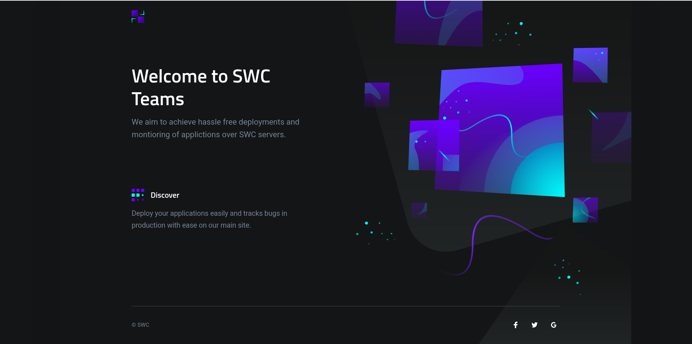
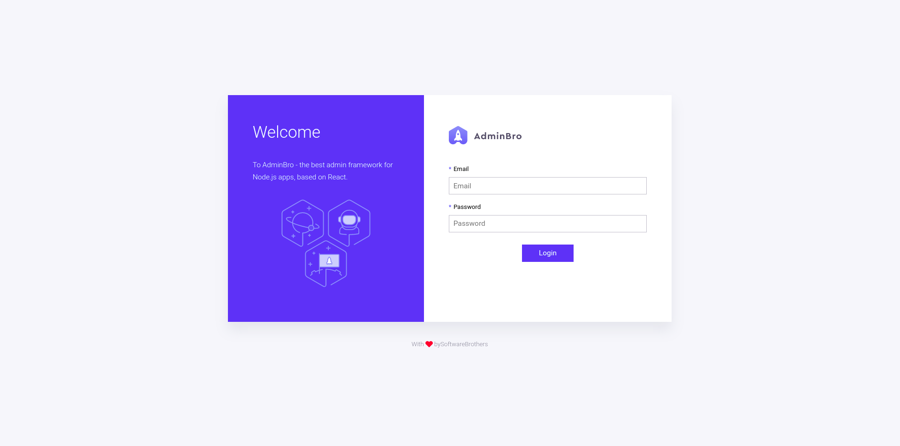

# Nodejs boilerplate    
     This is just another nodejs boilerplate with docker and eslint configuration to make dev easier .



## Skeleton

Here is the basic suggested skeleton for your app repo that each of the starter templates conforms to:

```bash
├── bin/www(server file)
├── controllers(all the views)
├── routes(all the routes)
├── models (all database models)
├── views
│    ├── **/*.js(ejs views)
├── public
    ├──uploads(all the media uploaded by user)
│   ├── css
│   │   ├── **/*.css
│   ├── images
│   ├── js
│   │   ├── **/*.js
│   └── partials/template
├── README.md
├── node_modules
├── Dockerfile
├── docker_compose.yaml
├── package.json
├── yarn.lock(if using yarn)
└── .gitignore
```

> If you are using multer to save files on disc,configure it to save files inside pulblic>upload folder

## Dev Setup

The docker files and environment variables are configured to be spin up mongo db inside one docker container and your applications inside another container.If you want to learn docker here is full [tutorial]()

> NOTE : Please do not remove the environment the variables already present inside the env file

```bash
  #To start the containers
  docker-compose up
  #Stop containers in diff terminal than docker
  docker-compose --volumes down
  #build docker images 
  docker-compose up --build #if there are changes in installed deps
  #faster builds
  COMPOSE_DOCKER_CLI_BUILD=1 DOCKER_BUILDKIT=1 docker-compose build
  #windows
  set "COMPOSE_DOCKER_CLI_BUILD=1" & set "DOCKER_BUILDKIT=1" & docker-compose build
  # or to make this permanent add following to docker daemon /etc/docker/daemon.json
  { "features": { "buildkit": true } }
```

**Helpers:**
1. Remove dangling images: `docker rmi $(docker images -f dangling=true -q ) -f`
2. Remove all volumes: `docker volume rm $(docker volume ls -q)`


**Admin panel:**


In dev you can use any valid email  pass can be anything for login into admin panel make sure to remove those in product


## Editor Setup

If you're using Visual Studio Code, you can install the ESLint extension, which
will automatically highlight warnings and errors using this boilerplate.

1. Press **Ctrl + Shift + X** or click the **Extensions** button
2. Search for **ESLint** and **Prettier(to format your code)**
3. Click the **Install** button next to the **ESLint** search result

With this extension, you can also choose to automatically fix/format your code
when you save. Add the following to your Visual Studio Code settings.

```
"eslint.autoFixOnSave": true
"editor.formatOnSave": true,
```

This setting only takes effect if `files.autoSave` is set to `off`,
`onFocusChange`, or `onWindowChange`.
